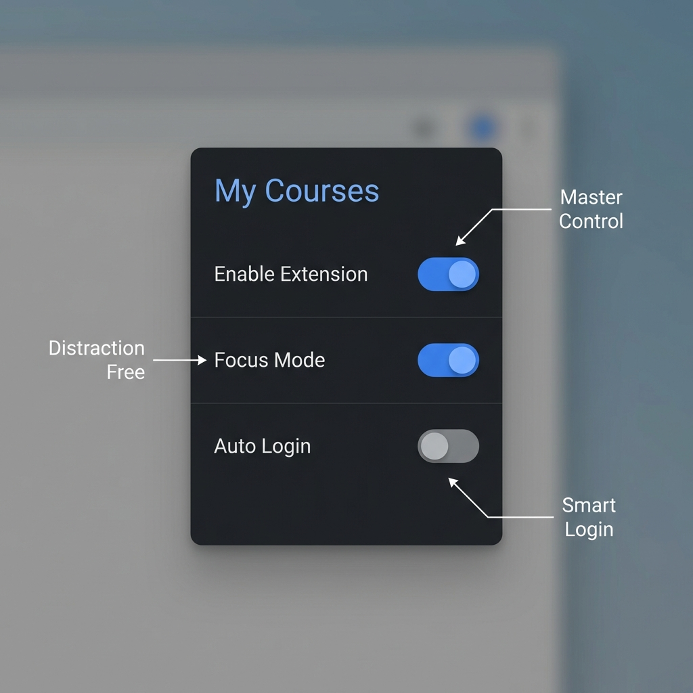

# 🎓 Better CourseWeb

**Better CourseWeb** is a browser extension for [SLIIT CourseWeb](https://courseweb.sliit.lk/) that makes **course filtration** easy and intuitive. It also includes handy side features like auto-login and a distraction-free focus mode.

---

## 🚀 Features at a Glance

### 1. 🔐 Intelligent Auto Login
Say goodbye to repetitive login screens. Better CourseWeb automatically detects when you're logged out and handles the login flow for you.
-   **OAuth Integrated:** Seamlessly clicks the "Continue with Microsoft" button.
-   **Smart Detection:** If you land on the homepage logged out, the extension knows and prompts you immediately.

### 2. 🧭 Global Navigation Menu
Access your courses from *any* page. No more going back to the dashboard just to switch subjects.
-   **Dropdown Menu:** A convenient dropdown injected right into the navbar.
-   **Semester Filtering:** Easily switch between current and past semesters.
-   **Smart Caching:** Courses load instantly without waiting for the API every time.

### 3. 🎯 Focus Mode
Need to study? Turn on Focus Mode to eliminate distractions.
-   **Remove Clutter:** Hides top navigation bars, sidebars, and footer links.
-   **Content Aware:** intelligently keeps vital content (like Student Manuals or Main Dashboard blocks) visible while hiding the noise.
-   **One-Click Toggle:** Enable it from the extension popup instantly.



### ⚙️ How to Use

1.  **Open the Popup:** Click the extension icon in your toolbar.
2.  **Master Control:** Use the top "Enable Extension" switch to turn the entire extension on/off instantly.
3.  **Focus Mode:** Toggle this to hide distractions like the top navigation bar.
4.  **Auto Login:** Enable this to skip the manual login process.

---

## 🛠️ Installation Guide

### Choose Your Version

You can choose between two versions of the extension depending on your preference:

#### Option 1: Enhanced UI & Clean Experience (Recommended)
Offers a more fluid, smooth UI for the menu and a cleaner LMS page interface.
```bash
git clone -b feature/moodle-new-workflow https://github.com/Nimsara-Jayarathna/sliit-course-filter-extension.git
```

#### Option 2: Standard Version
The normal version of the extension.
```bash
git clone https://github.com/Nimsara-Jayarathna/sliit-course-filter-extension.git
```

### Load as Unpacked Extension
1.  Open Chrome and navigate to:
    `chrome://extensions/`
2.  Enable **Developer mode** (top-right corner).
3.  Click **Load unpacked** and select the project folder (the one you just cloned).
4.  Refesh SLIIT CourseWeb to see the changes!

---

## 🤝 Contributing

We welcome contributions!
1.  Fork the repository.
2.  Create a feature branch (`git checkout -b feature/amazing-feature`).
3.  Commit your changes (`git commit -m 'Add amazing feature'`).
4.  Push to the branch (`git push origin feature/amazing-feature`).
5.  Open a Pull Request.

---

## ⚖️ Disclaimer

**Just for Fun!** ✌️
This project was created purely for educational purposes and to explore the capabilities of modern browser extensions. It serves as a personal playground for customization and offers an alternative workflow for students who enjoy tweaking their digital environment.

*This project is not officially affiliated with SLIIT.*
To use this version, clone the `v1.0` tag:
```bash
git clone -b v1.0 https://github.com/Nimsara-Jayarathna/sliit-course-filter-extension.git
```

*Note: The legacy version does not support fetching courses not already visible on the page.*
